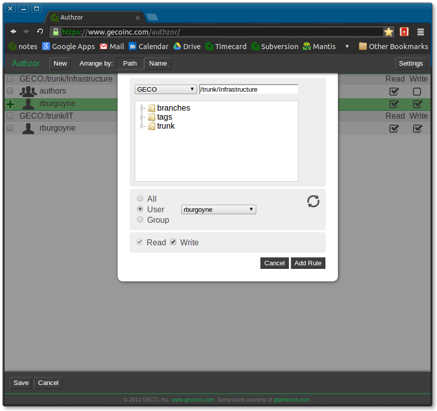

# authzor #

SVN authorization file management utility

Ryan Burgoyne
GECO, Inc.

## Installation ##

Install prerequisites apache2, git, python-ldap:

    sudo apt-get install apache2 git python-ldap

Change directory to your web root (on Ubuntu with apache2, /var/www)

    sudo git clone git://github.com/rburgoyne/authzor.git
    sudo chown -R www-data:www-data authzor

Edit your apache configuration to allow cgi scripts to execute in the cgi-bin
directory. For example, add the following to 
/etc/apache2/sites-enabled/000-default:

    <Directory /var/www/authzor/cgi-bin>
	Options +ExecCGI
        SetHandler cgi-script
    </Directory>

Add the following section as well, if you want to enable group-based LDAP 
authentication and authorization to access the page, changing the example 
values and group name to match your setup:

    <Directory /var/www/authzor>
            AuthType Basic
            AuthName "Enter administrative credentials"
            AuthBasicProvider ldap
            AuthzLDAPAuthoritative off
            AuthLDAPURL ldap://ldap.example.com:389/dc=example,dc=com
            Require ldap-group cn=admin, ou=group, dc=example, dc=com
    </Directory>

    sudo a2enmod authnz_ldap
    sudo service apache2 restart

The page will now be available at http://[hostname]/authzor
Make sure that your authz file is writable by the web user.

## Version history ##

2012-10-18 v0.5b
This is the initial release. All features are included, but error handling is not complete.
